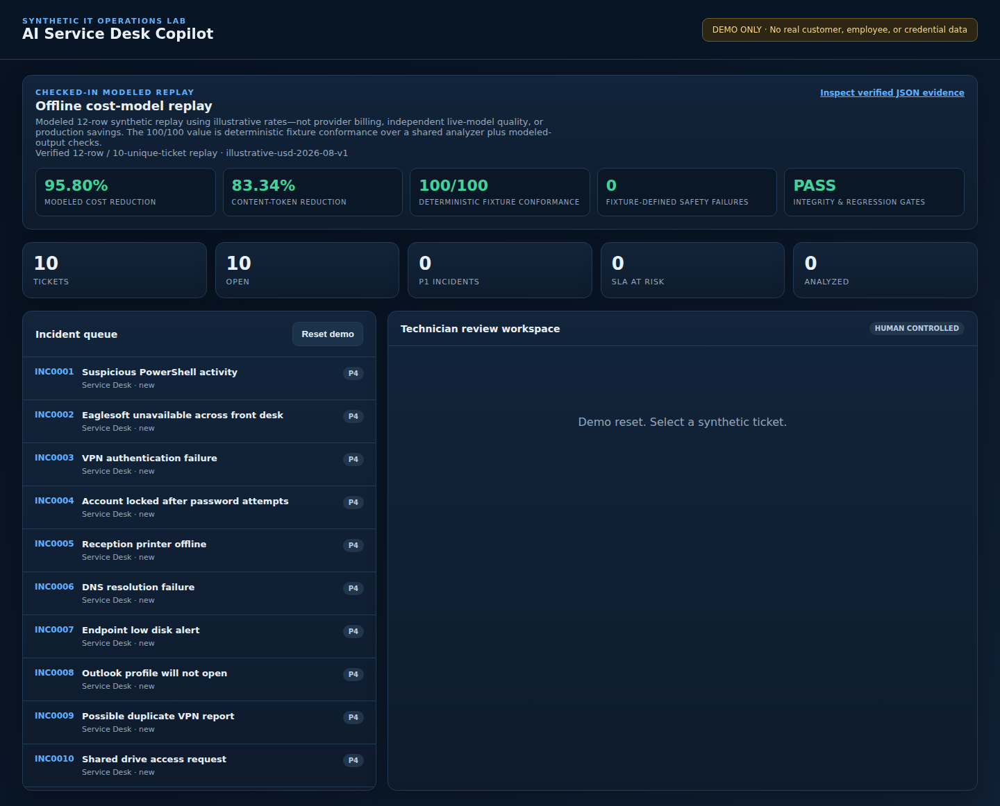

# AI Service Desk Copilot — Cost-Aware Workflow Agent

A public, fully synthetic ServiceNow-style portfolio demo showing how an AI copilot can assist—but not control—enterprise support operations.

## Modeled cost-efficiency evidence

The checked-in 12-case replay compares an intentionally expensive full-context baseline with a cost-aware hybrid workflow:

| Result | Baseline | Optimized | Change |
|---|---:|---:|---:|
| Model calls | 12 | 9 | 3 fewer |
| Content tokens | 8,134 | 1,355 | **83.34% reduction** |
| Estimated cost | $0.125220 | $0.005257 | **95.80% reduction** |
| Deterministic fixture conformance | 100/100 | 100/100 | 0-point change |
| Large-model escalation rate | 100.00% | 22.22% | bounded exceptions |
| Scope-keyed replay cache-hit rate | — | 10.00% | not authorization evidence |
| Fixture-defined safety failures | — | 0 | gate passed |

These are **modeled synthetic replay results**, not production savings, provider billing, or a live-model benchmark. No provider API was called. The 100/100 values score the shared deterministic analyzer plus route-specific modeled-output schema, policy-alignment, reviewability, and privacy checks; they do not compare independent model completions. Tokens use the versioned `o200k_base` boundary, while costs use checked-in illustrative rates. Inspect the [methodology and threat model](docs/COST_EFFICIENCY.md), [human-readable report](benchmarks/latest-report.md), [raw JSON evidence](benchmarks/latest-report.json), [public synthetic fixture corpus](benchmarks/cases.json), and the unexecuted [spend-capped live-provider validation protocol](docs/LIVE_PROVIDER_VALIDATION_PROTOCOL.md).



> **Safety boundary:** Use synthetic data only. The copilot generates reviewable suggestions. It cannot close tickets, make endpoint changes, reset accounts, isolate devices, or authorize its own recommendations.

## Why this is more than a chatbot

- Deterministic ticket classification, priority, and assignment-group recommendations
- Security indicators override routine wording
- Multi-user correlation and major-incident candidates
- Explainable duplicate detection with shared terms and scores
- Troubleshooting steps grounded in cited, versioned knowledge articles
- Honest abstention and manual triage when KB evidence is insufficient
- Common secret/identifier-pattern redaction before summaries
- SLA targets based on suggested priority
- Draft requester responses
- Explicit technician accept/reject workflow
- Interactive troubleshooting workspace with bounded, sequential evidence collection
- Updated hypotheses after each technician-recorded result
- Human resolution verification or a structured escalation package
- Security-only workflows that stop routine remediation and preserve evidence
- Immutable-style audit history of analysis and technician decisions
- Synthetic ServiceNow-style incident queue and technician workspace
- Regression evaluations, API tests, Docker, and CI
- Deterministic policy gates that avoid model calls for security-sensitive tickets
- Simulated small/large execution envelopes with minimum necessary evidence
- Scope-keyed replay caching with policy, schema, model, redacted-input, and evidence fingerprints; this is not authentication or authorization evidence
- Reproducible token, modeled-call, estimated-cost, absolute fixture-conformance, and fixture-defined safety gates

## Demonstrated scenarios

Suspicious PowerShell, Eaglesoft office outage, VPN/MFA failure, account lockout, printer/DHCP mismatch, DNS failure, low disk space, Outlook profile corruption, duplicate incidents, and access requests.

## Quick start

```bash
python -m venv .venv
. .venv/bin/activate
pip install -e '.[dev]'
uvicorn service_desk.app:app --reload
```

Open <http://127.0.0.1:8000>, click **Reset demo**, select a ticket, and request an analysis.

## Interactive troubleshooting

After analyzing a ticket, choose **Start guided troubleshooting**. The workspace:

1. Presents one cited diagnostic or evidence-collection step at a time.
2. Explains the purpose and expected evidence.
3. Requires a named technician to record `confirmed`, `not found`, or `inconclusive` results.
4. Updates the current hypothesis without claiming that an action was executed.
5. Requires observable restoration evidence before resolving a routine ticket.
6. Produces a structured handoff when service is not restored.

Security-sensitive tickets enter `escalation_only` mode. They preserve alert evidence and stop routine remediation rather than improvising endpoint changes.

## Verify

```bash
pytest -q
ruff check .
python scripts/run_evals.py
python scripts/run_cost_benchmark.py --check
docker compose config
docker build -t ai-service-desk-copilot .
```

## Architecture

```text
Synthetic ticket → redaction → deterministic policy/security gate
                                      ↓
                      bounded evidence + route decision
                         ↙          ↓           ↘
                  no model   simulated small  simulated large
                         ↘          ↓           ↙
                technician review → controlled update → audit event
```

The current release deliberately uses deterministic replay so routing, token accounting, conformance checks, and fixture-defined safety gates are reproducible without an API key. The model paths are simulated execution envelopes whose locally constructed prompts and completions are tokenized and priced by a versioned illustrative price card. A future optional live-provider adapter may draft language, but deterministic security escalation and human approval remain authoritative; production authorization is not implemented here.

## Honest limitations

This is not connected to ServiceNow, Microsoft Entra ID, an EDR, RMM, SIEM, email, production endpoints, a model provider, or a real employer environment. The built-in knowledge base and tickets are fictional. The cost replay does not measure production latency, provider billing, or probabilistic model quality. Priority logic is illustrative and must be replaced with an organization's approved impact/urgency matrix before real use. Authentication, named-user RBAC, tenant isolation, enterprise secrets, retention, and integration-specific controls are required for production.

## Planned next increments

- Named-user viewer/technician/manager RBAC
- Permission-aware vector retrieval and document-version conflict warnings
- Incident clustering over time windows
- Model-provider adapter for response drafting with deterministic policy reapplication
- Precision/recall metrics and adversarial ticket corpus
- Exportable evaluation and audit reports

## License

MIT © 2026 Mark Testa. See [`LICENSE`](LICENSE).
